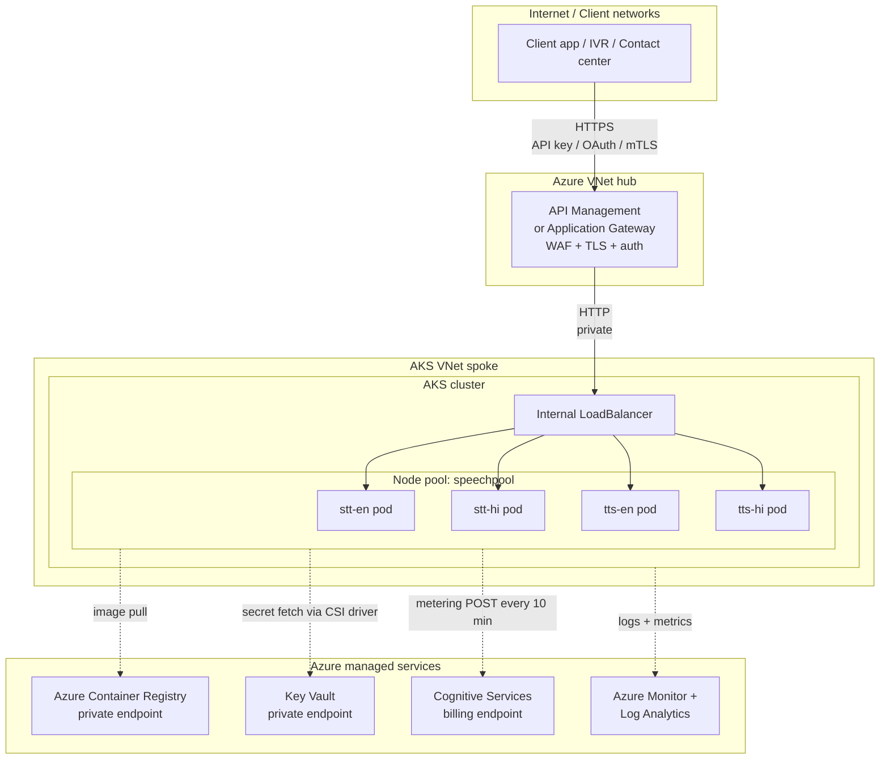

# 61 — AKS production hardening

> The demo deploys 4 public LoadBalancers with no auth and pulls images from public MCR. **Do not run that in production.** This doc lists what to change before going live.

## Architecture (target)



## What to change vs the demo

| Area | Demo | Production | How |
|------|------|------------|-----|
| **Service exposure** | 4× public `LoadBalancer` | Single internal LB behind APIM/AppGw | Annotate Service: `service.beta.kubernetes.io/azure-load-balancer-internal: "true"` |
| **Auth** | None | API key / OAuth2 / mTLS at gateway | APIM subscription keys, AAD JWT validation policy, or Azure App Gateway with mutual TLS |
| **TLS** | HTTP on port 80 | TLS-everything | Terminate TLS at APIM/AppGw with a Key Vault cert; pod-to-LB stays HTTP inside the VNet |
| **Image source** | Public MCR (slow, throttled, no version pinning) | Private ACR mirror | `az acr import` each image once, then point chart `image.registry` at your ACR |
| **Image pull auth** | Anonymous | AKS managed identity attached to ACR | `az aks update -g $RG -n $CLU --attach-acr <acr-name>` |
| **Secrets** | Key + billing endpoint passed via Helm `--set` (lands in Helm release secret) | Azure Key Vault + CSI Secrets Store driver | Install `aks-preview` add-on `azure-keyvault-secrets-provider`; mount as files; reference via env |
| **Network policy** | None — pods can reach anything | Egress deny-all except billing endpoint | `NetworkPolicy` allow `*.cognitiveservices.azure.com` and ACR endpoints only |
| **Resource limits** | Patched after install | Set in values via templating | Fork the chart or use a post-render kustomize layer; pin `requests==limits` for QoS Guaranteed |
| **HA / zones** | 2 nodes single zone | 3 nodes across zones 1+2+3 | `--zones 1 2 3` on `az aks nodepool add`; `topologySpreadConstraints` on Deployments |
| **Pod budget** | None (chart's PDB unused since `autoScaler.enabled=false`) | `PodDisruptionBudget minAvailable: 1` | Apply standalone PDB manifests in each namespace |
| **Autoscale** | Fixed 1 replica per Deployment | HPA on CPU + scale-to-zero off-hours | The chart's HPA uses deprecated `autoscaling/v2beta2` — write a fresh `v2` HPA manifest, target 70% CPU, min 1 max 4 |
| **Logging** | `kubectl logs` only | Container Insights → Log Analytics | `az aks enable-addons -a monitoring` |
| **Monitoring** | None | Azure Monitor metrics + dashboards | `az aks enable-addons -a azure-keyvault-secrets-provider,monitoring`; alert on `apiStatus != Valid` |
| **Billing connectivity** | Outbound to public Internet | Private endpoint or service endpoint to Cognitive Services | Service Endpoint on the AKS subnet for Microsoft.CognitiveServices |
| **Disaster recovery** | Single region | Active-active in 2 regions behind Front Door | Two clusters, identical Helm values, Front Door with health probes pointing at the gateways |

## Reference: Internal LoadBalancer values override

Add to each values file:

```yaml
speechToText:        # or textToSpeech, depending on chart
  service:
    type: LoadBalancer
    annotations:
      service.beta.kubernetes.io/azure-load-balancer-internal: "true"
```

## Reference: NetworkPolicy (egress allowlist)

```yaml
apiVersion: networking.k8s.io/v1
kind: NetworkPolicy
metadata:
  name: speech-egress
  namespace: speech-tts-en
spec:
  podSelector: {}
  policyTypes: [Egress]
  egress:
    - to:                              # billing endpoint
        - namespaceSelector: {}
      ports:
        - protocol: TCP
          port: 443
    - to:                              # DNS
        - namespaceSelector: {}
          podSelector: { matchLabels: { k8s-app: kube-dns } }
      ports:
        - protocol: UDP
          port: 53
```

(Tighten the first rule with `ipBlock` once you've identified the billing endpoint's stable IPs, or use Azure Firewall with FQDN rules in front of the cluster.)

## Reference: HPA v2 manifest (chart's HPA is broken)

```yaml
apiVersion: autoscaling/v2
kind: HorizontalPodAutoscaler
metadata:
  name: tts-en-hpa
  namespace: speech-tts-en
spec:
  scaleTargetRef:
    apiVersion: apps/v1
    kind: Deployment
    name: text-to-speech
  minReplicas: 1
  maxReplicas: 4
  metrics:
    - type: Resource
      resource:
        name: cpu
        target:
          type: Utilization
          averageUtilization: 70
```

## Cost levers

| Lever | Saving |
|-------|--------|
| Stop the cluster off-hours (`az aks stop`) | Up to 70% on VM cost |
| Reserved Instances on the speech node pool | ~30–40% off PAYG |
| Spot VMs for non-prod | ~70–80% off, but pods can be evicted with 30s notice |
| Right-size: D16ads_v5 if 1 pod per node is fine | ~50% per-node cost |

## Capacity per pod (proven)

With **8 vCPU / 8 GiB** per pod (the spec used in this demo):

| Container | Concurrent requests sustained | Notes |
|-----------|-------------------------------|-------|
| STT (en-IN, hi-IN) | ~10 real-time WebSocket streams | Stream-based; each stream uses ~0.5–0.8 vCPU |
| TTS (NeerjaNeural, SwaraNeural) | ~5 synthesis calls/sec, < 500 ms latency | First-byte ~250 ms once warm; cold start 30–60 s |

For 100k voice calls/month at peak concurrency 50 simultaneous calls (typical 8h business-day distribution), plan **5 STT pods + 10 TTS pods** = ~7 of these nodes. See `docs/40-sizing-100k-calls.md` for the full math.
